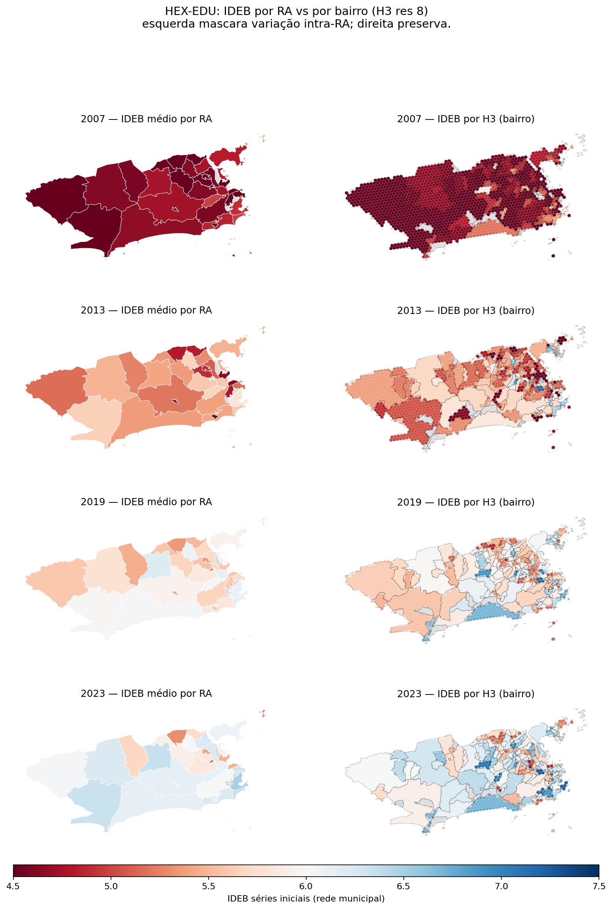

# HEX-EDU: desigualdade educacional no Município do Rio de Janeiro em granularidade fina

> Draft v0.5 (working paper) · Lucas Freire · 2026
>
> Este manuscrito cobre especificamente o produto HEX-EDU. Os outros 3 produtos do MVP-1
> ([THESHA-Rio](../reports/11_thesha_rio.md), [FUN-Rio](../reports/12_fun_rio.md),
> [PM-12](../reports/13_pm_12.md)) reforçam e estendem os achados aqui em direções
> ortogonais (decomposição mais fina, dimensão temporal, infraestrutura). Manuscritos
> dedicados aos outros 3 produtos ficam para v0.6+.

## Abstract

Painéis municipais de educação no Rio de Janeiro reportam o IDEB tipicamente em granularidade de Região Administrativa (RA, 33 unidades). Este trabalho mostra que essa escolha de agregação esconde a maior parte da variação relevante. Aplicando a decomposição de Theil-T sobre o IDEB de 163 bairros em 9 anos (2007–2023) da rede municipal, encontro que **66% da desigualdade total está dentro das RAs**, não entre elas. O resultado é robusto a (i) ponderação por matrícula, (ii) etapa escolar (séries iniciais e finais), e (iii) substituição do IDEB pelos seus dois componentes (Aprovação e SAEB). Como artefato concreto, construí o **HEX-EDU**, um mapa H3 do município no qual cada hexágono herda o IDEB do bairro do seu centroide. O contraste visual lado-a-lado com o coroplético tradicional por RA torna explícito o que a agregação esconde. Todos os dados, scripts e visualizações estão publicados em <https://freirelucas.github.io/rio-edu-lab/> e são reproduzíveis ponta-a-ponta a partir do data.rio.

## 1. Introdução

O Instituto Pereira Passos (IPP) publica desde os anos 2000 indicadores socioeconômicos do município do Rio de Janeiro através do portal data.rio. O Grupo Educação contém 186 itens, dos quais 127 são séries históricas em formato Excel e 35 são publicações em PDF (coleções Estudos Cariocas, Rio Estudos, Cadernos do Rio, Notas Técnicas IPP). Cinco itens — entre eles o painel IPS, o ATLAS ESCOLAR e o serviço de geometria de Escolas Municipais — concentram **89% das visualizações** do grupo (Relatório 01 deste lab). Há um gap evidente entre dado disponível e ferramenta de exploração.

A unidade espacial de análise praticamente sempre adotada por essas ferramentas é a **Região Administrativa**, que existe em escala municipal (33 RAs no Rio) e fornece um agregado conveniente para tabelas. Mas a granularidade administrativa que faz sentido para a estrutura de governo não necessariamente coincide com a granularidade em que a desigualdade educacional efetivamente ocorre.

Este paper mensura essa diferença e traduz o resultado em uma ferramenta visual.

### 1.1 Pergunta de pesquisa

A desigualdade educacional na rede municipal carioca é majoritariamente **entre Regiões Administrativas** (e portanto bem-mapeada por painéis no nível RA), ou **dentro delas** (e portanto mascarada pelo padrão atual)?

### 1.2 Contribuição

1. Decomposição empírica da inequidade do IDEB do Rio em componentes between-RA e within-RA, ano-a-ano (2007–2023).
2. Validação cruzada do resultado em 5 dimensões metodológicas (etapa escolar, ponderação por matrícula, indicador alternativo).
3. Implementação reprodutível do mapa H3 substitutivo (HEX-EDU), com versão estática e interativa publicadas no Pages.

### 1.3 Relação com a literatura

A decomposição aditiva de Theil em parcelas inter- e intra-grupo é Theil (1967). Aplicações ao Brasil incluem trabalho de Pereira et al. sobre acessibilidade (referência específica a confirmar; não localizada nos artefatos deste lab). O ineditismo aqui está na aplicação ao IDEB municipal carioca em granularidade de bairro com substrato H3 — um padrão que combina o método estatístico clássico (Theil) com a discretização espacial moderna (Uber H3).

## 2. Dados

### 2.1 IDEB por bairro

**Fonte**: data.rio item `9fd1a8cc207a48c5bda7131e4e74b1ca` ("IDEB das séries iniciais e finais segundo as Áreas de Planejamento, Regiões de Planejamento, Regiões Administrativas e Bairros"). Excel binário legacy (.xls), duas sheets de dados (`ANOS_INICIAIS`, `ANOS_FINAIS`), nove colunas de IDEB por sheet (anos pares 2007–2023).

A hierarquia AP → RP → RA → bairro é codificada na primeira coluna como label de texto, distinguível por padrões fixos: `Total`, `Área de Planejamento N`, `Região de Planejamento N.M - Nome`, `[romano] Nome` (RA), e bairros como linhas-folha. Recuperei 163 bairros, 33 RAs, 5 APs — bate exatamente com a divisão oficial do IPP.

Bairros com IDEB suprimido (rede privada/estadual dominante, baixa amostra, ou ausência de escola municipal) aparecem como `...` no Excel e são descartados na análise daquele ano.

### 2.2 Matrículas

**Fonte**: data.rio item `bba0d7d3c31c4cfd8a6940cc283d52cc` ("Matrículas na rede municipal de educação por AP, RP, RA e Bairros"). Excel legacy, uma sheet por ano, cobre 2010–2013 apenas. Janela de overlap com IDEB: 2011 e 2013.

### 2.3 Geometria dos bairros

**Fonte**: portal `pcrj.maps.arcgis.com`, item `dc94b29fc3594a5bb4d297bee0c9a3f2` ("Limite de Bairros") — fora do Grupo Educação, achado por search global. Feature Service em `pgeo3.rio.rj.gov.br/arcgis/rest/services/Cartografia/Limites_administrativos/MapServer/4`. 166 polígonos com atributos `nome`, `codbairro`, `codra`, `cod_rp`, `area_plane`. Após normalização de nomes (4 aliases manuais — diferenças de acentuação e parentéticos como "Freguesia (Ilha do Governador)" vs "Freguesia (Ilha)"), todos os 152 bairros nominais do IDEB casaram com a geometria.

## 3. Métodos

### 3.1 Theil-T

Para um conjunto de N unidades com valores positivos $y_i$, mean $\bar y$ e peso unitário (cada bairro = 1):

```
T = (1/N) * Σ_i (y_i / ȳ) * ln(y_i / ȳ)
```

Decomposição aditiva por grupos g (RAs):

```
T_between = Σ_g (n_g/N) * (ȳ_g/ȳ) * ln(ȳ_g/ȳ)
T_within  = Σ_g (n_g/N) * (ȳ_g/ȳ) * T_g
T         = T_between + T_within
```

A propriedade aditiva é exata em precisão de ponto flutuante. Validação numérica (`T_b + T_w − T < 1e-6`) é garantida em todas as decomposições reportadas.

### 3.2 Variante ponderada

Substituindo $1/N$ pelos pesos relativos $w_i / W$ onde $w_i$ é matrícula no bairro:

```
T_w = Σ_i (w_i/W) * (y_i/ȳ_w) * ln(y_i/ȳ_w)
```

com $\bar y_w = (Σ w_i y_i)/W$. Decomposição idêntica, substituindo $n_g/N$ por $W_g/W$.

### 3.3 Substrato espacial H3

Grade Uber H3 resolução 8 (≈ 0.7 km² por hex) cobrindo o município, gerada por `h3.h3shape_to_cells` aplicado ao polígono união dos 166 bairros. Resultado: 1593 hexes, todos com centroide dentro de algum bairro (sjoin via geopandas, predicate=`within`, em CRS projetado SIRGAS 2000 / UTM 23S). Cada hex herda o IDEB do bairro do seu centroide.

Dos 166 bairros, 159 contêm pelo menos um centroide H3 nesta resolução; 7 (Abolição, Argentino, Bancários, Cocotá, Jabour, Lapa, Saúde) são pequenos demais e ficam invisíveis no res 8. Subir para res 9 (~12k hexes) os cobriria.

## 4. Resultados

### 4.1 Decomposição IDEB séries iniciais

| Ano | n bairros | IDEB médio | T total | T entre | T dentro | % entre | % dentro |
| ---: | ---: | ---: | ---: | ---: | ---: | ---: | ---: |
| 2007 | 150 | 4.59 | 0.0048 | 0.0019 | 0.0028 | 41% | 59% |
| 2009 | 149 | 5.10 | 0.0052 | 0.0017 | 0.0036 | 32% | 68% |
| 2011 | 148 | 5.48 | 0.0044 | 0.0014 | 0.0030 | 31% | 69% |
| 2013 | 148 | 5.33 | 0.0066 | 0.0018 | 0.0048 | 27% | 73% |
| 2015 | 147 | 5.63 | 0.0040 | 0.0013 | 0.0026 | 33% | 67% |
| 2017 | 145 | 5.80 | 0.0035 | 0.0013 | 0.0022 | 38% | 62% |
| 2019 | 145 | 5.81 | 0.0026 | 0.0009 | 0.0018 | 32% | 68% |
| 2021 | 129 | 5.47 | 0.0045 | 0.0017 | 0.0028 | 39% | 61% |
| 2023 | 147 | 6.00 | 0.0035 | 0.0011 | 0.0024 | 32% | 68% |

**Achado central**: em todos os 9 anos, **T_within > T_between**. Média da parcela within = **66%**. IDEB médio sobe de 4.59 (2007) para 6.00 (2023); desigualdade total cai ~25%; mas o padrão dentro/entre é estável.

### 4.2 Robustez (1): séries finais

A mesma decomposição em ANOS_FINAIS (9º ano) preserva o achado: parcela within média **70%**, ligeiramente maior que séries iniciais (67%). Compatível com a hipótese de stratificação acumulada — desigualdade entre escolas dentro de bairros cresce conforme a etapa escolar avança.


### 4.3 Robustez (2): ponderação por matrícula

| Ano | T total uniforme/ponderado | % within uniforme/ponderado |
|---:|:---:|:---:|
| 2011 | 0.0045 / 0.0023 | 68% / 58% |
| 2013 | 0.0066 / 0.0038 | 70% / 62% |

Ponderação por matrículas reduz T_total em ~44% e a parcela within em ~9 pontos percentuais. Mas **within continua > 50%** sob ponderação. A interpretação: parte da heterogeneidade aparente vem de bairros pequenos com IDEB ruidoso, mas a maior parte é sinal real.

### 4.4 Robustez (3): indicadores alternativos

Aplicando o mesmo método a Aprovação (%), Média SAEB e IDEB (que é o produto dos dois) separadamente:

| Componente | Mean | T total médio | share_within médio |
|:---|---:|---:|---:|
| Aprovação | 95.0% | 0.0008 | 70% |
| SAEB | 5.85 | 0.0029 | 64% |
| IDEB | 5.43 | 0.0043 | 66% |

T_total cresce de Aprovação para SAEB (Aprovação tem teto natural ~100%) e ainda mais para IDEB (efeito amplificador da multiplicação de quantidades positivamente correlacionadas). Mas a parcela within fica em **64–70%** nos três casos. **Within > between é robusto à escolha de indicador.**

### 4.5 Manifestação visual: HEX-EDU

A figura abaixo mostra o IDEB de 2023 em duas resoluções espaciais: agregado por RA (esquerda, 33 unidades) e por hex H3 res 8 (direita, 1593 unidades, herdando do bairro do centroide).


A imagem da esquerda — formato dominante nos painéis municipais — sugere distribuição razoavelmente homogênea acima da média. A imagem da direita revela **bolsões persistentes de IDEB baixo** dentro de RAs cuja média é "ok" (Zona Norte e Zona Oeste, especialmente).

### 4.6 Trajetória 2007–2023



A melhora do IDEB ao longo dos anos é visível em ambas as resoluções — toda a distribuição se desloca para o azul. Mas a heterogeneidade dentro das RAs persiste em 2023, mesmo com média municipal acima de 6.0.

## 5. Discussão

### 5.1 Implicação para política pública

Painéis em granularidade de RA são apropriados para gestão por coordenação regional (CRE), mas insuficientes para alocação fina de recursos compensatórios. Política focada em RA como unidade homogênea aplica intervenção uniforme onde a desigualdade é heterogênea — em escala média, isso significa subinvestir em bairros vulneráveis dentro de RAs "boas" e superinvestir em bairros já bem servidos dentro de RAs "ruins".

A migração para granularidade de bairro nas ferramentas públicas (que esta análise demonstra ser metodologicamente viável e visualmente legível) corrige esse erro de framing. O custo computacional é trivial — todo o pipeline reproduzível roda em um laptop em minutos.

### 5.2 O que o HEX-EDU não resolve

- **Granularidade real é a escola, não o bairro**. Cada hex herda IDEB uniforme do bairro inteiro. Variância intra-bairro só apareceria com IDEB por escola, que não está publicado em granularidade pública pelo data.rio (apesar de existir no microdado INEP).
- **Rede municipal apenas**. Bairros onde a rede privada ou estadual domina aparecem como "sem dado" — viés sistemático contra zonas de classe média alta, mesmo onde a qualidade educacional possa ser pior por outras métricas.
- **MAUP**. Fronteiras de bairro mudam ao longo dos anos; algumas comparações inter-anuais carregam ruído de fronteira.

### 5.3 Próximos passos do produto

- **Folium interativo** já publicado com seletor de ano: <https://freirelucas.github.io/rio-edu-lab/reports/08_hex_edu_interactive/>.
- **Streamlit hospedado** com filtros adicionais (faixa de IDEB, ponderação opcional, comparação ano-a-ano) fica para v0.2.
- **Replicação numérica direta de Pereira et al. (2019)** depende de localizar o paper-base; backlog.

## 6. Limitações

Resumo das limitações de cada seção, agregadas:

1. **Recorte temporal**: IDEB disponível apenas em anos pares 2007–2023; matrícula apenas 2010–2013. A janela de overlap para Theil ponderado é 2 pontos.
2. **Granularidade espacial residual**: bairro é a menor unidade pública; intra-bairro fica preto.
3. **Cobertura de rede**: somente municipal. Sem comparabilidade direta com privada/estadual.
4. **Detecção de ano em metadados** (Relatório 03): heurística por regex em cabeçalhos; cells numéricas em range [1990, 2030] no corpo da tabela são contagens (ex.: número de professores), não anos. Restrição da detecção numérica às primeiras 4 linhas do sheet resolveu o problema.
5. **MAUP**: documentado, não corrigido.
6. **Replicação bibliográfica pendente**: a referência "Pereira et al. (2019)" no README do ACEC-Hub não foi localizada e portanto não foi replicada.

## 7. Reprodutibilidade

Todo o pipeline está em <https://github.com/freirelucas/rio-edu-lab>. Os 17 scripts em `analysis/` rodam ponta-a-ponta com `pip install -r requirements.txt` e Python 3.10+:

```bash
git clone https://github.com/freirelucas/rio-edu-lab.git
cd rio-edu-lab
pip install -r requirements.txt -r requirements-docs.txt

# Pipeline completo
for n in 01 02 03 04 05 06 07 08 09 10 11 12 13 14 15 16 17; do
  python3 analysis/${n}_*.py
done

# Site
mkdocs build --strict
```

Sanity check do achado central:

```python
import csv
rows = list(csv.DictReader(open('data/processed/theil_ideb_anos_iniciais.csv')))
shares = [float(r['share_within']) for r in rows]
print(f"share_within: min={min(shares):.0%}, max={max(shares):.0%}, mean={sum(shares)/len(shares):.0%}")
# expected: min=59%, max=73%, mean=66%
```

## 8. Referências

- Theil, H. (1967). *Economics and Information Theory*. North-Holland.
- INEP (Instituto Nacional de Estudos e Pesquisas Educacionais Anísio Teixeira). IDEB — metodologia. <https://www.gov.br/inep/>
- IPP (Instituto Pereira Passos). data.rio — Grupo Educação. <https://www.data.rio/>
- Uber Engineering (2018). H3: A Hexagonal Hierarchical Spatial Index. <https://h3geo.org/>
- Pereira et al. (2019). Referência citada no README do ACEC-Hub; título exato e DOI não localizados nos artefatos disponíveis. Replicação numérica pendente.

## 9. Como citar

```bibtex
@misc{freire2026hexedu,
  author       = {Freire, Lucas},
  title        = {{HEX-EDU}: desigualdade educacional no Município do Rio de Janeiro em granularidade fina},
  year         = {2026},
  version      = {v0.1 draft},
  howpublished = {\url{https://github.com/freirelucas/rio-edu-lab}},
}
```
