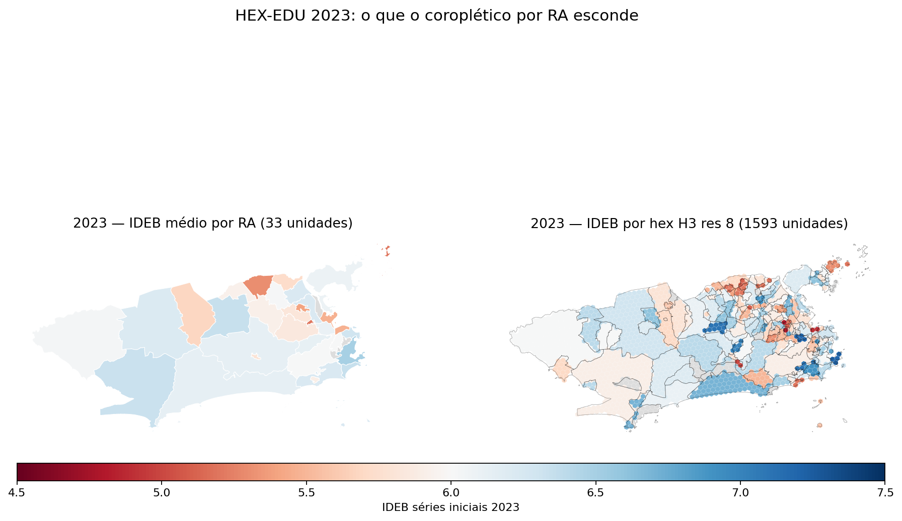

# 📐 HEX-EDU

> Aplicação do **H3 hexagonal grid** ao IDEB municipal carioca. **v0.6.1 entrega replicação parcial de Pereira et al. (2019) IPEA**: acessibilidade ponderada por IDEB. v0.5 decomposição Theil-T continua disponível como análise complementar.

[](https://hdl.handle.net/10419/240730)
[](../reports/14_acessibilidade.md)
[](../reports/06_theil_ideb.md)
[](../mapa.md)

## Paper-base

**Pereira, R. H. M.; Braga, C. K. V.; Serra, B.; Nadalin, V. G. (2019).** *Desigualdades socioespaciais de acesso a oportunidades nas cidades brasileiras — 2019.* IPEA Texto para Discussão. <https://hdl.handle.net/10419/240730>

**Método dos autores**: discretização do território urbano em hexágonos H3 (resolução variável conforme densidade), cálculo de **acessibilidade a oportunidades** (educação, saúde, emprego, lazer) ponderada pela **proximidade temporal** (isócronas via OSM) e pela **qualidade/quantidade** da oportunidade. Decomposição da acessibilidade por **renda** e **raça** revela inequidades sistemáticas: pessoas brancas e de alta renda têm maior acessibilidade.

**Cidades cobertas no paper**: São Paulo, Rio de Janeiro, Belo Horizonte, Recife, Fortaleza, Porto Alegre, Curitiba (transporte público) + 20 cidades para transporte ativo.

!!! info "Para gestores públicos"
    - **Achado em uma frase**: a AP 3 (Zona Norte) entrega o maior acesso ponderado por IDEB do município (média 113); a Zona Sul, apesar de IDEB médio alto, fica em 59 por baixa densidade de escolas — e a AP 4 (Barra/Jacarepaguá) em 29.
    - **Implicação para política**: planejamento educacional municipal precisa combinar **qualidade** e **densidade**. Olhar só média de IDEB por região esconde vazios de oferta em áreas onde a qualidade existe mas a opção é distante.
    - **Três ações concretas**:
        1. Priorizar **expansão da rede em AP 4** (raio 5 km com poucas escolas elegíveis acima da mediana de IDEB).
        2. Auditar o **Centro (AP 1)** — 2º maior acesso ponderado (96) com uso potencialmente subaproveitado por residentes não-Centro.
        3. Combinar este mapa com o de [VULN-EDU](vuln_edu.md) para identificar bairros onde **baixo acesso × alta vulnerabilidade socioeconômica** se sobrepõem.
    - **Como auditar**: [Relatório 14](../reports/14_acessibilidade.md), código em `analysis/26_hex_accessibility.py`, dados em `data/processed/hex_accessibility.csv`.

## v0.6.1 — acessibilidade ponderada por IDEB ✅

Para cada hex H3 (1593 unidades, res 8) computamos:

```
acesso_quality(i) = Σ_j IDEB(j) · exp(-d(i,j)/d0)
```

onde j são os equipamentos eleg. (Escola Municipal + CIEP + Especial = 1022) em raio de 5 km, `d` é a distância haversine ao equipamento, e `d0 = 1.5 km` é o parâmetro de impedância. **`acesso_quality` é a métrica Pereira-style**: oportunidade educacional ponderada pela qualidade de cada opção e penalizada exponencialmente pela distância.

**Achado da v0.6.1**: AP 3 (Zona Norte) lidera o acesso ponderado (média **113**), seguida do Centro (96). Zona Sul fica em 59 e AP 4 (Barra/Jacarepaguá) em 29. **Zona Norte alta densidade > Zona Sul alta qualidade isolada**. Detalhes técnicos no [Relatório 14](../reports/14_acessibilidade.md).

**Próximo (v0.7)**: substituir distância haversine por isócronas reais via OSM road network (osmnx) + decompor por SES real (IPS/IDS).

## v0.5 — decomposição Theil-T ✅

Análise complementar da inequidade do IDEB municipal por bairro. Usa o mesmo grid H3 da v0.6 mas aplica decomposição de Theil em vez de métrica de acesso.

**Achado**: 66% da desigualdade do IDEB municipal carioca está **dentro das RAs**, não entre. Coropléticos por RA mascaram a maior parte da variância. ([Relatório 06](../reports/06_theil_ideb.md))

Ambas as análises usam o mesmo substrato espacial (H3 res 8 + bairros oficiais IPP). A v0.6 mede "quanta opção tenho perto"; a v0.5 mede "quanta variância existe entre opções, agregada por escala administrativa".

## Visualizações disponíveis hoje

### Mapa estático: RA vs H3 (2023)



Esquerda: por RA (33). Direita: por hex H3 (1593). Mesma escala de cor, mesmo dado. Bolsões vermelhos visíveis na direita estão dentro de RAs cuja média é "ok".

[:material-map: Versão interativa em /mapa/](../mapa.md){ .md-button }

### Robustez do achado Theil (linha do tempo, 6 séries)

<div data-chart="../../_assets/charts/tour_slide_3.json"></div>

A parcela within-RA fica entre 59% e 73% em todos os 9 anos, em todas as 6 séries (5º, 9º, ponderado, Aprovação, SAEB, IDEB).

## Caveats

- **A v0.5 não é Pereira et al. 2019 ainda**. É uma sub-análise (Theil sobre H3 grid) que reusa o substrato espacial. A replicação completa fica para v0.6 — declarado explicitamente.
- **Apenas rede municipal**. Bairros com escola privada/estadual dominante saem do dataset municipal de IDEB.
- **MAUP** (Brewer & Pickle 1999): sensibilidade à definição de unidade de área. Documentado.
- **Peso igual por bairro** na versão base. Ponderação por matrícula reduz T_total ~44% mas preserva o achado within > between (Relatório 06b).

## Reproduzir (v0.5)

```bash
pip install -r requirements.txt
pip install -e reference/acec-hub

python3 analysis/03_download_excels.py     # IDEB Excel
python3 analysis/10_theil_ideb.py          # decomposição base
python3 analysis/11_fetch_bairros.py       # geometry IPP
python3 analysis/12_h3_grid.py             # H3 res 8
python3 analysis/13_hex_edu_static.py      # mapas estáticos
python3 analysis/14_hex_edu_folium.py      # mapa interativo
```

Sanity check do achado:

```python
from acec.stats import theil_decompose
import pandas as pd
df = pd.read_csv("data/processed/ideb_bairros.csv")
df = df[df["year"] == 2023].dropna()
t, tb, tw = theil_decompose(df["ideb"], df["ra"])
print(f"share_within = {tw/t:.0%}")  # 68%
```

## Referências

- **Pereira, R. H. M.; Braga, C. K. V.; Serra, B.; Nadalin, V. G. (2019).** *Desigualdades socioespaciais de acesso a oportunidades nas cidades brasileiras — 2019.* IPEA. <https://hdl.handle.net/10419/240730>. **Paper-base canônico do HEX-EDU**.
- **Theil, H. (1967).** *Economics and Information Theory*. North-Holland. **Método estatístico-base da decomposição Theil-T usada na sub-análise atual.**
- Brewer, C. A.; Pickle, L. (1999) — método do MAUP, citado nos caveats.

## Continue

<div class="grid cards" markdown>

-   [:material-map: Mapa interativo](../mapa.md)
-   [:material-rocket-launch-outline: Tour 5 min](../tour.md)
-   [:material-format-list-bulleted: Bairros prioritários](../bairros-prioritarios.md)
-   [:material-book-open-variant: Investigação técnica](../investigacao.md)

</div>
