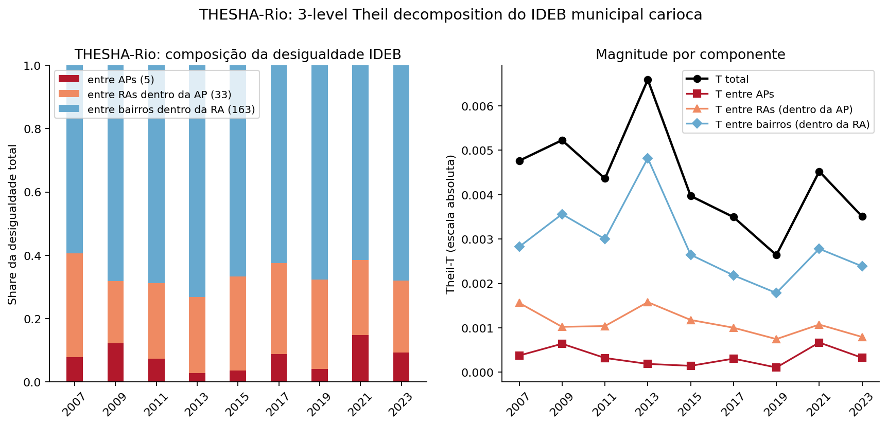

# 🪜 THESHA-Rio

> Decomposição da desigualdade educacional do Rio em 3 níveis aninhados: bairro **dentro de** RA **dentro de** AP. **A política focada em escala administrativa larga (AP) esconde 92% da variância.**

[](https://doi.org/10.1111/j.1475-4991.2007.00250.x)
[](../reports/11_thesha_rio.md)

<div class="compare-grid" markdown>

<div class="compare-paper" markdown>
### Bourguignon, Ferreira & Menéndez (2007)

**O que é**: o paper "Inequality of Opportunity in Brazil" decompõe a desigualdade de renda brasileira em **componente determinístico por características** (educação dos pais, raça, região de origem) e **componente residual** (esforço/sorte/erro).

**Método**: aplicar Theil-T (e índices afins) sobre observações individuais agrupadas por características hierárquicas. Permite medir quanto da desigualdade de renda é "explicada" por circunstâncias herdadas.

**Achado canônico**: 22–32% da desigualdade brasileira de renda é atribuível a circunstâncias de origem. O resto é "esforço + sorte". Implicação política: redução substancial possível só atacando inequidade de oportunidades.

**Inovação metodológica que reusamos**: a estrutura de decomposição aninhada — desigualdade **entre** características de alto nível, **entre** sub-tipos dentro do alto nível, e **dentro** dos sub-tipos.
</div>

<div class="compare-rio" markdown>
### O que achamos no Rio

**O que é**: a mesma decomposição aninhada, **mas espacial**. A "característica hierárquica" aqui é geografia administrativa: AP (5 zonas) → RA-em-AP (33 unidades) → bairro-em-RA (163).

**Identidade aditiva** (testada com `acec.theil_decompose_nested`):

```
T_total = T_between_AP + T_between_RA_em_AP + T_within_RA
```

**Decomposição (média 9 anos)**:

| Componente | Share |
|---|---:|
| entre **APs** (5 zonas) | **8%** |
| entre **RAs dentro da AP** (33) | **26%** |
| entre **bairros dentro da RA** (163) | **67%** |

A maior parte da desigualdade vive na **menor unidade pública** que conseguimos resolver.
</div>

</div>

## Comparação

Bourguignon et al. perguntavam: "quanto da desigualdade de renda vem da origem do indivíduo?" — e descobriram que é uma fração não-trivial (22–32%). A pergunta no nosso caso é diferente: "**quanto da desigualdade de IDEB vem do nível geográfico de agregação?**"

Resposta análoga: agregar até AP captura 8%, agregar até RA captura 8% + 26% = 34%, agregar até bairro captura 100% do mensurável publicamente. Cada aumento de granularidade revela algo que a granularidade anterior escondia.

A diferença interessante com o paper: lá, há um teto natural (não toda desigualdade pode ser explicada por origem). Aqui, há um teto técnico (não conseguimos descer abaixo de bairro com dado público; intra-bairro fica preto).

## Decomposição visualizada



Esquerda: composição dos 3 componentes ao longo de 9 anos (stacked share). Direita: magnitude absoluta de cada componente.

## Implicação para política

| Granularidade do painel | Variância capturada |
|---|---:|
| Município (1 número) | 0% |
| AP (5 zonas) | 8% |
| RA (33 unidades) | 34% |
| **Bairro (163 unidades)** | **100% do mensurável publicamente** |

Mais fino que bairro só com microdado escolar do INEP — fora do escopo do data.rio.

## Caveats

- **Peso igual por unidade** (mesma limitação da v0.1 do HEX-EDU). Ponderação por matrícula seria robustez forte; backlog porque matrícula só cobre 2010–2013.
- **5 APs apenas**: T_between_AP tem só 4 graus de liberdade. Outliers movem muito.
- **Mesma fonte que HEX-EDU**: `9fd1a8cc...`. Não é validação por dado independente.
- **Decomposição aditiva é matemática, não causal**: dizer "8% vive na escala AP" não significa que 8% das diferenças seriam removidas se as APs fossem unificadas.

## Reproduzir

```bash
pip install -r requirements.txt
pip install -e reference/acec-hub

python3 analysis/10_theil_ideb.py     # gera ideb_bairros.csv
python3 analysis/18_thesha_rio.py     # roda decomposição 3-level
```

Sanity check da identidade:

```python
from acec.stats import theil_decompose_nested
import pandas as pd
df = pd.read_csv("data/processed/ideb_bairros.csv")
df = df[df["year"] == 2023].dropna()
d = theil_decompose_nested(df["ideb"], df["ra"], df["ap"])
residual = d["T_total"] - d["T_between_outer"] - d["T_between_inner"] - d["T_within_inner"]
assert abs(residual) < 1e-9
```

## Referências

- Bourguignon, F.; Ferreira, F. H. G.; Menéndez, M. (2007). "Inequality of Opportunity in Brazil". *Review of Income and Wealth* 53(4), 585–618. [DOI](https://doi.org/10.1111/j.1475-4991.2007.00250.x)
- Theil, H. (1967). *Economics and Information Theory*.

## Continue

<div class="grid cards" markdown>

-   [:material-map: HEX-EDU 2-níveis (RA vs bairro)](hex_edu.md)
-   [:material-clock-time-eight-outline: FUN-Rio (decomposição temporal)](fun_rio.md)
-   [:material-format-list-bulleted: Bairros prioritários](../bairros-prioritarios.md)
-   [:material-text-box-outline: Relatório técnico](../reports/11_thesha_rio.md)

</div>
