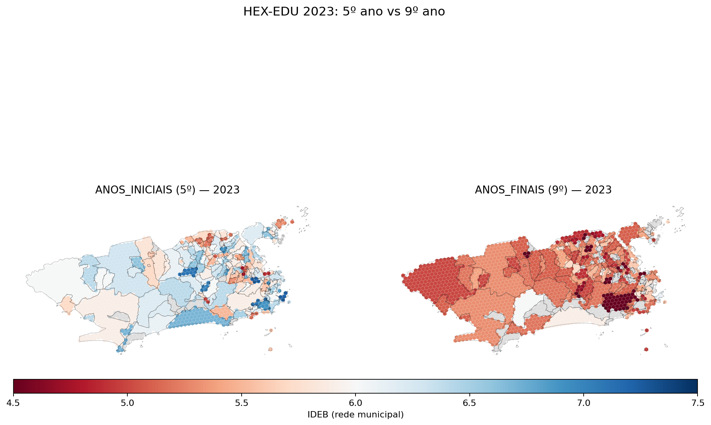

# 09 — IDEB séries finais (9º ano): mesma análise, etapa diferente

Os Relatórios 06 (Theil) e 07–08 (HEX-EDU) cobriram só **séries iniciais** (5º ano). A mesma fonte (`9fd1a8cc...`) traz uma sheet `ANOS_FINAIS` com o IDEB de 9º ano. Aqui replicamos a decomposição Theil-T sobre essa sheet e geramos o mapa lado-a-lado para 2023.

## Mapa: 5º vs 9º (2023)



## Theil decomposition: 5º (ANOS_INICIAIS) vs 9º (ANOS_FINAIS)

Mesma metodologia do Relatório 06 (peso igual por bairro, agrupamento por RA).

| Ano | n bairros (5º/9º) | IDEB médio (5º/9º) | T total (5º/9º) | % within (5º/9º) |
| ---: | :---: | :---: | :---: | :---: |
| 2007 | 150/120 | 4.588 / 4.281 | 0.004763 / 0.004573 | 59% / 70% |
| 2009 | 149/121 | 5.103 / 3.56 | 0.005226 / 0.011566 | 68% / 66% |
| 2011 | 148/119 | 5.479 / 4.46 | 0.004362 / 0.005229 | 69% / 68% |
| 2013 | 148/121 | 5.329 / 4.337 | 0.006587 / 0.008484 | 73% / 73% |
| 2015 | 147/121 | 5.634 / 4.301 | 0.00397 / 0.008242 | 67% / 83% |
| 2017 | 145/114 | 5.797 / 4.711 | 0.003494 / 0.005081 | 62% / 63% |
| 2019 | 145/116 | 5.808 / 4.921 | 0.002639 / 0.003996 | 68% / 62% |
| 2021 | 129/75 | 5.472 / 5.042 | 0.004523 / 0.004522 | 61% / 62% |
| 2023 | 147/121 | 6.002 / 5.178 | 0.003508 / 0.003083 | 68% / 63% |

## Achados

- **IDEB médio**: 5º ano = **5.47**; 9º ano = **4.53** (média sobre 9 anos). Queda de 0.94 pontos entre 5º e 9º — consistente com a literatura (qualidade percebida cai conforme avançam os anos do ensino fundamental).
- **Parcela within-RA**: 5º ano = **66%**; 9º ano = **68%** (média sobre 9 anos). 9º ano tem **MAIOR** desigualdade dentro das RAs do que 5º ano — compatível com a hipótese de stratificação acumulada (efeitos cumulativos de evasão/transferência se concentram em poucas escolas dentro de bairros já vulneráveis).
- **Conclusão substantiva**: o achado central do Relatório 06 (within > between) vale tanto para 5º quanto para 9º ano. Não é artefato da etapa escolar.

## Caveats herdados

Tudo do Relatório 06 continua valendo. Para 9º ano, um adicional: muitos bairros têm **menos escolas com 9º ano municipal** (a oferta cai a partir do 6º ano), o que aumenta variância amostral e pode inflar T_within mecanicamente. Ponderar por número de escolas/matrículas (Sessão 6) ajuda a separar sinal de ruído.

## Reprodutibilidade

```bash
python3 analysis/15_anos_finais.py
```
Saídas: `data/processed/ideb_anos_finais.csv`, `data/processed/theil_ideb_anos_finais.csv`, `data/processed/theil_iniciais_vs_finais.csv`.
