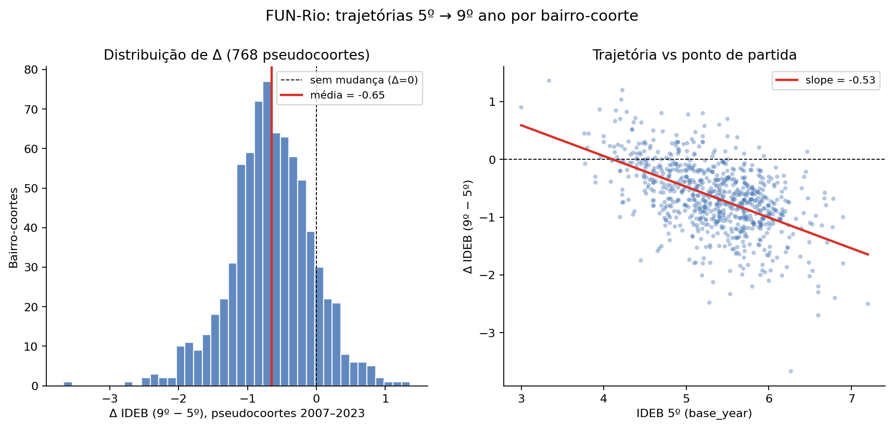
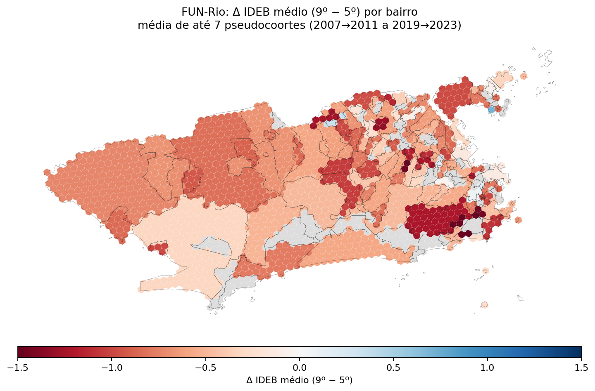

# 12 — FUN-Rio: trajetórias 5º → 9º ano por pseudocoorte

Terceiro produto do MVP-1 do ACEC-Hub. Inspirado em Mare (1980) sobre transições educacionais e Reardon & Owens (2014) sobre segregação no percurso escolar.

**Definição operacional**: a turma que faz IDEB 5º ano no ano T volta a ser medida como IDEB 9º ano em T+4 (mesma coorte estimada). Para cada bairro com dados em ambos:

```
Δ[bairro, T] = IDEB_9º[bairro, T+4] − IDEB_5º[bairro, T]
```

Com IDEB bienal, há 7 pseudocoortes possíveis (2007→2011 a 2019→2023).

## Visualizações





## Achados (números reais)

- **768 pseudocoortes** observadas (bairro × base_year), ~124 bairros distintos.
- **Δ médio** = -0.65 (mediana = -0.67). **A maioria das coortes piora** ao avançar de 5º para 9º (87% têm Δ < 0).
- **Slope Δ vs IDEB-5º base** = -0.53. Bairros que começam com IDEB 5º mais alto **caem mais** ao chegar no 9º — indício de regressão à média ou perda diferencial nas zonas mais bem servidas (alunos mudando para rede privada ao avançar o ciclo escolar).

## Distribuição por base_year

| Base | n | Δ médio | Δ p10 | Δ p90 |
| ---: | ---: | ---: | ---: | ---: |
| 2007 | 118 | -0.13 | -0.72 | +0.41 |
| 2009 | 121 | -0.74 | -1.52 | -0.03 |
| 2011 | 119 | -1.13 | -1.94 | -0.39 |
| 2013 | 112 | -0.60 | -1.17 | +0.11 |
| 2015 | 112 | -0.67 | -1.27 | -0.01 |
| 2017 | 71 | -0.68 | -1.26 | -0.14 |
| 2019 | 115 | -0.61 | -1.04 | -0.16 |

## Top 10 quedas (5º → 9º)

| Base | AP | Bairro | IDEB 5º | IDEB 9º | Δ |
| ---: | :--- | :--- | ---: | ---: | ---: |
| 2009 | 3 | Del Castilho | 6.27 | 2.60 | -3.67 |
| 2011 | 2 | Humaitá | 6.60 | 3.90 | -2.70 |
| 2015 | 3 | Encantado | 7.20 | 4.70 | -2.50 |
| 2011 | 2 | Praça da Bandeira | 5.28 | 2.80 | -2.48 |
| 2013 | 3 | Encantado | 6.80 | 4.40 | -2.40 |
| 2011 | 1 | Santo Cristo | 5.53 | 3.20 | -2.33 |
| 2011 | 3 | Encantado | 6.60 | 4.30 | -2.30 |
| 2011 | 3 | Todos os Santos | 6.60 | 4.40 | -2.20 |
| 2011 | 2 | Jardim Botânico | 5.80 | 3.60 | -2.20 |
| 2011 | 3 | Galeão | 5.33 | 3.20 | -2.12 |

## Caveats

- **Pseudocoorte ≠ coorte real**: o 5º ano de 2007 não é estritamente o mesmo grupo de alunos do 9º de 2011 (perdas, transferências, repetências). Com microdado INEP por escola seria possível seguir a coorte real; com dado agregado por bairro, é uma proxy.
- **Mudança de rede**: alunos de 5º que migram para escola privada antes do 9º **saem** da nossa amostra municipal. Se eles eram tipicamente os de IDEB mais alto, isso enviesa Δ para baixo nas zonas onde a migração para privada é mais comum (Zona Sul, Barra). Esse é o sinal econômico real, mas não pode ser separado do efeito puramente educacional sem dado de matrícula privada por bairro.
- **Pseudocoorte usa anos pares**: 2007→2011 mistura 2 ciclos de avaliação. Versão futura poderia usar microdados anuais quando disponíveis.

## Reprodutibilidade

```bash
python3 analysis/10_theil_ideb.py     # gera ideb_bairros.csv
python3 analysis/15_anos_finais.py    # gera ideb_anos_finais.csv
python3 analysis/19_fun_rio.py        # este script
```

<!-- continue-lendo -->

## Continue lendo

!!! tip ""
    - [Bairros prioritários (cruzamento com PM-12)](../bairros-prioritarios.md)
    - [09 — IDEB séries finais (9º)](09_anos_finais.md)
    - [HEX-EDU (produto canônico)](../produtos/hex_edu.md)
