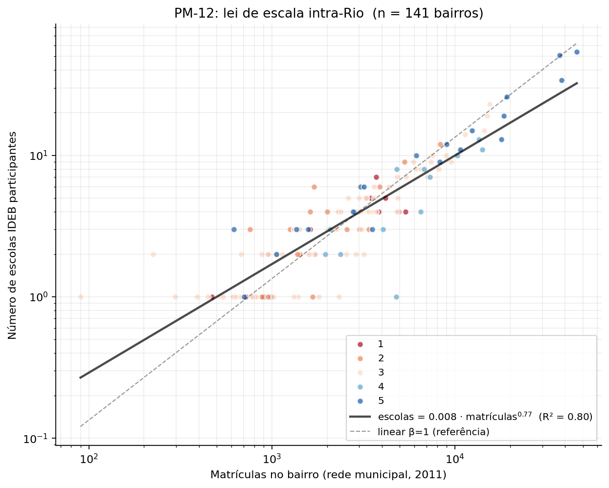
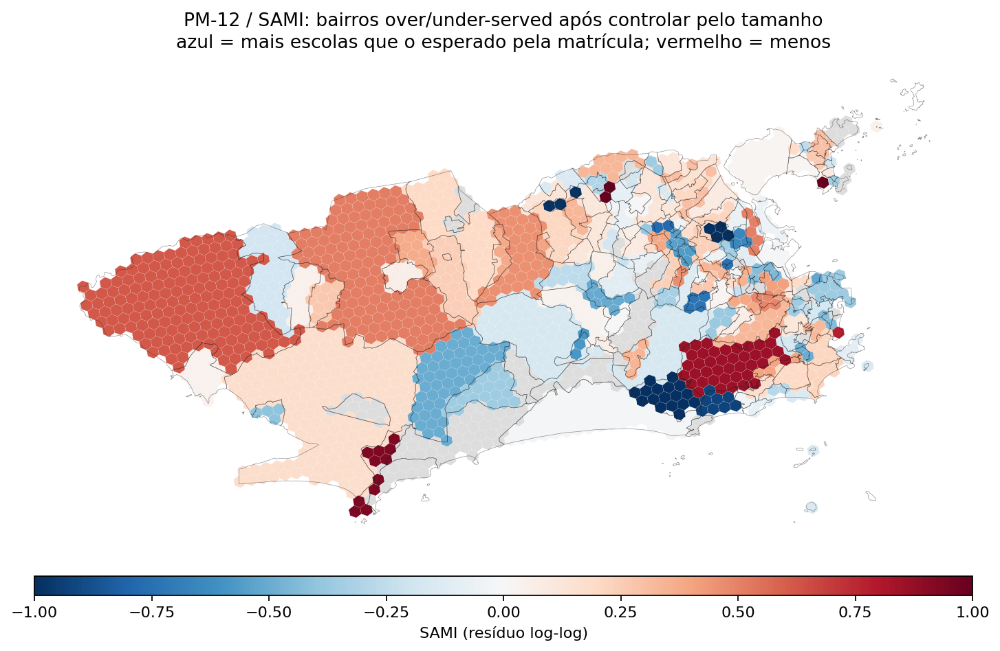

# 13 — PM-12: lei de escala intra-Rio (Bettencourt et al.)

Quarto produto do MVP-1. Adapta a metodologia de leis de escala urbanas (Bettencourt et al. 2010) e indicador ajustado por escala (SAMI; Heinrich Mora et al. 2023) do nível **inter-cidade** para o nível **intra-Rio**: cada bairro é um ponto, e perguntamos como o número de escolas escala com o número de matrículas.

Modelo:

```
escolas = A · matrículas^β
```

Interpretação canônica:
- β = 1: alocação linear (1 escola por N alunos, constante)
- β > 1: superlinear → bairros maiores têm desproporcionalmente mais escolas
- β < 1: sublinear → bairros maiores têm desproporcionalmente menos escolas

## Ajuste empírico (2011)

- Bairros com matrícula + escolas IDEB participantes: **141**

- Intercepto A: **0.0084**

- Expoente **β = 0.7679**

- R² = **0.797**


**Interpretação**: β = 0.768 < 1 → alocação **sublinear**. Bairros maiores têm desproporcionalmente menos escolas por aluno. Em outras palavras, quanto maior o bairro em matrícula, **pior** sua razão escolas/matrícula. Isso é compatível com infra escolar consolidada décadas atrás (quando as zonas hoje populosas eram menos populosas) e não acompanhando o crescimento populacional municipal — efeito reportado no Brasil para várias capitais.

## Visualizações





## SAMI (Scaling Adjusted Indicator)

Para cada bairro:

```
SAMI = log(escolas_observadas) − log(escolas_previstas pela lei de escala)
```

SAMI > 0 → bairro tem mais escolas que o previsto pela sua matrícula.
SAMI < 0 → bairro tem menos escolas que o previsto.

O mapa H3 acima mostra o SAMI distribuído pelo município. Bairros vermelhos são os candidatos prioritários para alocação adicional de escolas pública — não pela matrícula absoluta, mas pelo desvio relativo à curva de escala municipal.

### Top 8 bairros com maior déficit relativo (SAMI mais negativo)

| Bairro | AP | Matrículas | Escolas | SAMI |
| :--- | ---: | ---: | ---: | ---: |
| Itanhangá | 4 | 4,776 | 1 | -1.73 |
| Complexo do Alemão | 3 | 2,325 | 1 | -1.18 |
| Ricardo de Albuquerque | 3 | 1,811 | 1 | -0.99 |
| São Conrado | 2 | 1,668 | 1 | -0.92 |
| Vicente de Carvalho | 3 | 1,385 | 1 | -0.78 |
| Maria da Graça | 3 | 1,322 | 1 | -0.74 |
| Lins de Vasconcelos | 3 | 3,188 | 2 | -0.73 |
| Bonsucesso | 3 | 2,879 | 2 | -0.65 |

### Top 8 bairros com maior superávit relativo (SAMI mais positivo)

| Bairro | AP | Matrículas | Escolas | SAMI |
| :--- | ---: | ---: | ---: | ---: |
| Barros Filho | 3 | 90 | 1 | +1.32 |
| Cacuia | 3 | 224 | 2 | +1.31 |
| Barra de Guaratiba | 5 | 619 | 3 | +0.94 |
| Alto da Boa Vista | 2 | 1,698 | 6 | +0.85 |
| Flamengo | 2 | 760 | 3 | +0.78 |
| Santa Cruz | 5 | 37,367 | 51 | +0.62 |
| Campo Grande | 5 | 46,331 | 54 | +0.51 |
| Maré | 3 | 15,506 | 23 | +0.50 |

## Caveats

- **Janela: só 2011**. Único ano com matrícula por bairro e IDEB simultâneos. Replicação em 2013 fica como backlog (matrícula 2013 disponível; IDEB 2013 também).
- **'Escolas' = Escolas Participantes do IDEB**, não cadastro completo. Subestima em bairros cujas escolas não participam do IDEB (escolas novas, baixa amostra). Versão futura: cruzar com Feature Service `0a220ea7...` (Escolas Municipais) para count completo via spatial join.
- **Comparação com Bettencourt et al. (2010) é metodológica, não numérica**. Eles fitavam β a indicadores cross-cidade; aqui estamos intra-cidade. Os regimes de β esperados podem ser diferentes — nossa hipótese de β ≈ 1 vem da lógica de alocação INEP, não da literatura cross-city.
- **R² alto não implica modelo correto**. Power law é um modelo simples; alternativas (piecewise linear, modelo com efeitos fixos por AP) ficam como robustez para v0.6.

## Reprodutibilidade

```bash
python3 analysis/16_theil_weighted.py  # gera matriculas_bairros.csv
python3 analysis/20_pm_12.py           # este script
```
